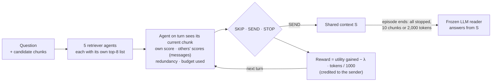

# MA-Chunk: Cost-Aware Multi-Agent Context Curation for RAG

> Anonymous code release accompanying the AAMAS 2027 submission *"When Does Multi-Agent Reinforcement Learning Help Context Curation? Cost-Aware Retriever Agents for Frozen LLM Readers"*.

Retrieval-augmented generation (RAG) usually hands a frozen LLM a fixed number of retrieved chunks, although every chunk costs tokens and irrelevant ones invite wrong answers. **MA-Chunk** turns the choice of what to send into a cooperative multi-agent problem: five retrievers (BM25, static word vectors, two dense encoders and a cross-encoder) act as agents that take turns writing chunks to a shared context under a token price, and are trained with a team reward paid as each chunk's marginal contribution.

This repository contains:
- a **Gymnasium environment** for multi-agent context curation, with switches for reward (marginal, terminal, selfish, precision-aware), turn order, messages and message noise, agent failures, rich observations and distractor agents;
- **data** for CRAG (250 questions), HotpotQA and MuSiQue (1,000 each): candidate pools with the five agents' scores, usefulness labels and RAGAS-aligned labels;
- **training and evaluation** code: PPO / A2C / DQN / Recurrent PPO, static and supervised baselines, robustness tests, a common LLM reader and judge, an abstention agent and RAGAS evaluation;
- the **scripts that generate every table and figure** of the paper, and the paper source.

## How an episode works



Training never calls an LLM: the utility of a chunk comes from labels computed once. One shared policy (agent identity in the observation) is trained with PPO; a five-fold run takes about 16 minutes and 4 Wh on one CPU core. Full details: [docs/ENVIRONMENT.md](docs/ENVIRONMENT.md).

## Main results

| Finding | Evidence |
|---|---|
| Several agents beat one | +0.015 team reward over a centralized RL agent on the fused ranking, 15/15 dataset–seed clusters (p_Holm < 0.001) |
| Agents learn whom to trust | A misleading retriever (AUC 0.42) sends ≤ 2% of the messages, a random one ≤ 0.1% |
| Credit design matters only with redundant evidence | Selfish rewards: 3–7× more tokens and team reward −0.28 vs 0.33 on CRAG; identical policies on multi-hop QA |
| RL vs. supervised selection | RL wins with the same inputs (15/15 clusters); ties with richer engineered features |
| Robustness needs failure-aware training | Losing the cross-encoder: 0.462 → 0.085 team reward on CRAG; training with agent dropout cuts the worst failure loss by 61–95% |
| Efficiency | On CRAG, statistically tied with ColBERTv2 and Search-R1 in answer score and RAGAS while sending 240–480 instead of 1,100–1,530 input tokens per question |
| The reader is the bottleneck | Oracle contexts still give 29–39% wrong answers; a perfect selector adds only 0.01–0.03 to the mean RAGAS score |

## Quick start

```bash
pip install -r requirements.txt && python -m spacy download en_core_web_md && pip install -e .
python scripts/data/split_join.py join          # rebuild the two large data files
python -m pytest                                # property tests of the environment and rewards

# train MA-Chunk (messages on) on HotpotQA, token price 1.0, seed 0, 5-fold CV
python -m ma_chunk.train_ma --pool data/hotpotqa/candidates.parquet --variant ma_msg \
       --lams 1.0 --seeds 0 --timesteps 200000 --out-dir results/validation/hotpotqa/runs
```

The output `results/validation/hotpotqa/runs/ma_msg_lam1.0_s0.parquet` holds, for every test-fold question, the chunks the team sent and the per-question metrics; `runs/curves/` holds the learning curves. Evaluating with the LLM reader, the abstention agent and RAGAS needs `OPENAI_API_KEY` in `.env` (see [docs/REPRODUCE.md](docs/REPRODUCE.md)).

### Using the environment directly

```python
from ma_chunk.env_ma import AGENTS, MAChunkEnv
from ma_chunk.train_ma import load_pool, make_queries

pool = load_pool(top_m=8)                                      # CRAG candidates + usefulness labels
queries = make_queries(pool, pool["interaction_id"].unique(), 8, AGENTS)
env = MAChunkEnv(queries, lam=0.3, share_scores=True, seed=0)    # MA+msg, token price 0.3

obs, info = env.reset()
done = False
while not done:
    action = env.action_space.sample()                        # SKIP=0, SEND=1, STOP=2 for the acting agent
    obs, reward, done, truncated, info = env.step(action)
print(info)  # utility, chunks, tokens, team reward and AP of the episode
```

## Repository layout

```
ma_chunk/            package
  env_ma.py            the multi-agent environment (Dec-POMDP, turn-based)
  train_ma.py          training under K-fold CV (PPO, A2C, DQN, Recurrent PPO)
  candidates.py        CRAG candidate pools (5 retrievers)          multihop_data.py   HotpotQA / MuSiQue pools
  labels.py            usefulness labels (LLM judge)                attr_labels.py     RAGAS-aligned labels
  baselines.py         static top-k, RRF, oracle                    sup_select.py      supervised selectors
  robustness.py        message noise, agent failures, transfer      gate.py            abstention agent
  eval_reader.py       end task with the common reader and judge    ragas_eval.py      RAGAS evaluation
  reader.py, llm.py, ragas_metrics.py, text.py, config.py           shared utilities
data/                candidate pools and labels (docs/DATA.md)
scripts/run/         training launcher for grids of token prices and seeds
scripts/paper/       statistics, tables and figures of the paper
scripts/data/        data utilities
tests/               property tests (budgets, termination, reward telescoping, RAGAS AP formula)
docs/                ENVIRONMENT · PROTOCOL · REPRODUCE · DATA
paper/               paper source (LaTeX), generated tables and figures
```

## Documentation

- [docs/ENVIRONMENT.md](docs/ENVIRONMENT.md): agents, observation and action spaces, rewards, variants, training settings, learning-flow diagrams.
- [docs/PROTOCOL.md](docs/PROTOCOL.md): pre-specified hypotheses, statistics, deviations and outcomes.
- [docs/REPRODUCE.md](docs/REPRODUCE.md): step-by-step reproduction, compute and API cost, results-archive layout.
- [docs/DATA.md](docs/DATA.md): data files, columns, rebuilding and licenses.

## Citation

The citation will be added after the review period.

## License

Code: MIT (see [LICENSE](LICENSE)). Data derived from CRAG, HotpotQA and MuSiQue keep their original licenses (see [docs/DATA.md](docs/DATA.md)).
