# MA-Chunk environment, reward and training

Technical reference for using, reproducing and extending the environment. Code:
[`ma_chunk/env_ma.py`](../ma_chunk/env_ma.py) (environment) and [`ma_chunk/train_ma.py`](../ma_chunk/train_ma.py) (training).

## 0. Concepts

| Concept | In general | In MA-Chunk |
|---|---|---|
| Agent | Who makes decisions | Each of the 5 retrievers (BM25, spaCy, MiniLM, E5, cross-encoder) |
| Environment | The world that reacts to decisions | One question: the agents' candidate lists, a shared channel and a budget (`MAChunkEnv`) |
| Episode | One complete attempt | One question; agents act until the channel closes |
| Step (turn) | One decision of one agent | An agent looks at its current chunk and chooses SKIP, SEND or STOP |
| Observation | What the acting agent sees (partial) | 21 numbers: scores, chunk size, budget used, redundancy with the channel, ... The agent never sees whether a chunk is useful |
| Action space | All possible actions | `Discrete(3)`: SKIP, SEND, STOP |
| Reward | Signal returned after each action | On SEND: how much the evidence in the context increased, minus the chunk's token cost; 0 otherwise |
| Return | Sum of rewards of an episode | `R = U(S) − λ·tokens(S)/1000` |
| λ (token price) | Weight between competing objectives | High λ gives short contexts, low λ longer ones |
| Policy | Learned rule from observation to action | One small network (2 × 64 units) shared by the 5 agents (agent identity in the observation) |
| Credit assignment | How team merit is split among agents | Each agent gets exactly the gain its own message added (marginal contribution) |
| Dec-POMDP | Cooperative multi-agent problem with partial observations and a team reward | The formal model of MA-Chunk |

## 1. Agents

| Agent | Score of a chunk for the question |
|---|---|
| `bm25` | BM25 (rank_bm25), normalized by the page maximum |
| `spacy` | Cosine of static `en_core_web_md` word vectors |
| `minilm` | Cosine, `sentence-transformers/all-MiniLM-L6-v2` |
| `e5` | Cosine, `intfloat/e5-base-v2` (`query:` / `passage:` prefixes) |
| `ce` | Cross-encoder `cross-encoder/ms-marco-MiniLM-L-6-v2`, sigmoid of the logit |

## 2. Utility: "evidence in the context"

The context `S` has evidence when it contains the information that supports the correct answer. It is decided **before** the reader answers, from usefulness labels computed once:

| Dataset | A chunk is useful when | Utility `U(S)` |
|---|---|---|
| CRAG | An LLM judge, given question, gold answer and chunk, says the chunk lets a reader answer correctly (topical overlap is not enough); 7,492 chunks labelled ([`labels.py`](../ma_chunk/labels.py)) | 1 if at least one useful chunk was sent (`n_support = 1`) |
| HotpotQA / MuSiQue | The paragraph is one of the gold supporting paragraphs ([`multihop_data.py`](../ma_chunk/multihop_data.py)) | Fraction of the gold paragraphs sent |

The proxy is aligned with the end task: the reader answers correctly 59–88% of the time when `U = 1` and 3–18% when `U = 0`.

Optional **RAGAS-aligned labels** ([`attr_labels.py`](../ma_chunk/attr_labels.py)) ask, for every chunk, RAGAS's own context-recall question ("can each sentence of the reference be attributed to this context?"); `--utility attr` uses the covered fraction of reference sentences and `--utility mix` the mean of both utilities.

## 3. Episode dynamics

- 1 episode = 1 question. Each agent holds its own top-M list (`top_m = 8`) ranked by its score.
- Turns: one agent acts at a time. Default round-robin (bm25 → spacy → minilm → e5 → ce); alternatives `random` and `confidence` (the agent with the highest normalized score on its current candidate speaks).
- Chunks already in the channel are skipped automatically.
- The episode ends when every agent has stopped or exhausted its list, or the channel reaches `max_chunks = 10` or `token_budget = 2000` tokens.
- No LLM call during training: rewards use the precomputed labels.

## 4. Action space

`Discrete(3)`; only the acting agent acts.

| Value | Name | Effect |
|---|---|---|
| 0 | `SKIP` | Move to the next chunk of the agent's own list |
| 1 | `SEND` | Write the chunk to the shared channel read by the LLM |
| 2 | `STOP` | The agent stops contributing for this question |

## 5. Reward

| Quantity | Meaning | Min | Max |
|---|---|---|---|
| `U(S) = min(1, n_useful / n_support)` | Fraction of the needed evidence in the context | 0 | 1 |
| `n_support` | Evidence pieces the question needs | 1 (CRAG) | 2 (HotpotQA), 4 (MuSiQue) |
| `λ` (`lam`) | Price per 1,000 tokens (fixed per run) | 0 | 2 (grid used: 0.1, 0.3, 0.6, 1, 2) |
| `tokens(c)` | Chunk cost (`cl100k_base`) | 5 | 4,939 (CRAG); median ≈100–120 |
| **`r` on SEND** `= U(S+c) − U(S) − λ·tokens(c)/1000` | Marginal contribution minus cost | `−λ·4.94` | `+1` (CRAG), `+1/n_support` (multi-hop) |
| `r` on SKIP / STOP | | 0 | 0 |
| **Return** `R = U(S) − λ·tokens(S)/1000` | Exact sum of the episode's rewards | ≈ `−6.9·λ` | 1 |

Properties (proved in the paper, checked by [`tests/`](../tests)):
- **Proposition 1 (telescoping):** rewards sum exactly to `R(S_T)`; each agent's credit is the marginal utility of its own messages minus their cost.
- **Proposition 2:** if utility is additive (multi-hop: each useful chunk is a distinct gold paragraph), the selfish reward equals the marginal reward. If utility saturates (CRAG: one useful chunk is enough), the selfish reward also pays redundant messages, which creates a social dilemma.

`--reward-mode` options:

| Mode | Reward per step | Use |
|---|---|---|
| `marginal` (default) | as above | Main method |
| `terminal` | 0 at every step, `R(S_T)` at the end | Ablation: no credit decomposition |
| `individual` | SEND pays `1[useful]/n_support − λ·tokens(c)/1000` even if the evidence is already there | Ablation: selfish agents |
| `marginal_ap` | marginal + `β·ΔAP(S)` (`--ap-weight β`) | MA-Chunk-P: AP is the RAGAS context-precision formula over the channel order |

Test-time metrics (utility, team reward, AP, chunks, tokens) are always computed the same way, whatever reward was used for training.

## 6. Observation space

Observation of the acting agent: 21 dimensions (`Box`, float32).

| Index | Variable | Meaning | Min | Max |
|---|---|---|---|---|
| 0–4 | `agent_onehot` | Who is acting (all zeros for the single agent) | 0 | 1 |
| 5–9 | `scores[b]` | Each retriever's score for the current chunk: the agent's own always; the others' only as **messages** (MA+msg) or for the single agent. No message or failed agent = 0 | −1 | 1 |
| 10 | `own_score` | The agent's own score | −1 | 1 |
| 11 | `ptr / top_m` | Position in the agent's list | 0 | 0.875 |
| 12 | `agreement` | Fraction of the other agents that also have the chunk in their top-8 | 0 | 1 |
| 13 | `redundancy` | Max MiniLM cosine between the chunk and those already sent | −1 | 1 |
| 14 | `channel_tokens / 2000` | Token budget used | 0 | 1 |
| 15 | `len(channel) / 10` | Chunk budget used | 0 | 1 |
| 16 | `own_sends / 10` | Chunks this agent already sent | 0 | 1 |
| 17 | `others_sends / 10` | Chunks the others already sent | 0 | 1 |
| 18 | `ptr / len(list)` | Progress through the list | 0 | < 1 |
| 19 | `min(2, tokens(c)/512)` | Size of the current chunk | ≈0.01 | 2 |
| 20 | `channel_empty` | 1 if nothing was sent yet | 0 | 1 |

Optional extensions:

| Flag | Extra dims | Meaning |
|---|---|---|
| `--rich-obs` | +5, +5 | Per-question z-score of each retriever's score (clipped to ±5) and `log1p(rank)/log1p(1000)` |
| `--agent-dropout p` | +5 | Presence mask (1 = agent available); during training each agent fails with probability `p` per episode (at least one stays) |

Test-time robustness options (no retraining): `msg_noise = σ` (Gaussian noise on messages) and `disabled_agents` (failed agents neither act nor send messages).

## 7. Variants

| Tag | Agents | Messages | Observation | Training |
|---|---|---|---|---|
| `ma` | 5 | no | standard | standard |
| `ma_msg` (**main**) | 5 | yes | standard | standard |
| `ma_msg_rich` | 5 | yes | + z-scores and log-ranks | standard |
| `ma_msg_drop0.2` (**recommended for deployment**) | 5 | yes | + presence mask | each agent fails with p = 0.2 per episode |
| `ma_msg_rand` | 5 + random agent | yes | 6-agent layout | standard |
| `ma_msg_rw-marginal_ap_to-confidence` (**MA-Chunk-P**) | 5 | yes | standard | precision-aware reward, confidence turn order |
| `single` (ablation) | 1 over the RRF-fused list (k = 60) | sees all scores | no one-hot | standard; top-40 list |

## 8. Training

| Item | Value |
|---|---|
| Algorithm | PPO (Stable-Baselines3 2.6.0), one policy **shared** by all agents; A2C, DQN, Recurrent PPO available via `--algo` |
| Network | `MlpPolicy`, `net_arch = [64, 64]` |
| Hyperparameters | `n_steps = 2048`, `batch_size = 256`, `learning_rate = 3e-4`, `ent_coef = 0.01`, `gamma = 1.0`; others SB3 defaults |
| Steps | 200,000 per fold (5 folds = 10⁶ per run) |
| Validation | `StratifiedKFold(5, shuffle=True, random_state=seed)`, stratified by domain (CRAG); always evaluated on the test fold |
| Seeds | 0–2 (ablations), 0–4 (main comparisons); the seed fixes the folds, so variants are paired |
| Inference | `model.predict(deterministic=True)`; 5–8 ms per question on one core |
| Cost | ≈16 min and ≈4 Wh per five-fold run on one CPU core (`torch.set_num_threads(1)`) |
| Reproducibility | Same seed → bit-identical results (verified on 36 runs) |
| Outputs | `runs/<tag>.parquet` (selections and per-question metrics), `runs/curves/<tag>.json` (learning curves), `runs/models/<tag>_f<fold>.zip` (`--save-models`) |

## 9. Learning flow and where gold labels are used

Yellow = steps that use the gold answer (directly or through labels); blue = steps that never see it (what agents observe and what runs in deployment).

```mermaid
flowchart TB
  subgraph PREP["1 · Offline preparation, once per dataset"]
    Q["Question + candidate page or paragraphs"]
    GOLDA[("GOLD answer / supporting paragraphs")]
    RET["5 retrievers score every chunk<br/>BM25 · spaCy · MiniLM · E5 · cross-encoder"]
    POOL["Candidate pool<br/>top-8 of each agent"]
    LAB["Usefulness labels and n_support<br/>CRAG: LLM judge, chunk vs gold answer<br/>multi-hop: is it a supporting paragraph?"]
    Q --> RET --> POOL --> LAB
    GOLDA --> LAB
  end

  subgraph TRAIN["2 · RL training on the training folds"]
    START(["Episode start: 1 question, empty channel S"])
    TURN["Acting agent (round-robin)<br/>looks at the next chunk of its own top-8 list"]
    OBS["Observation: 21 values, NO gold<br/>own score + messages · list position · agreement<br/>redundancy with S · budget used · chunk tokens"]
    POL["Shared PPO policy (64×64)"]
    ACT{"Action"}
    SKIP["SKIP"]
    SEND["SEND: chunk enters S"]
    STOP["STOP: agent leaves"]
    REW["Reward from the labels<br/>SEND: r = ΔU(S) − λ·tokens/1000<br/>SKIP / STOP: r = 0"]
    END{"Episode over?<br/>all stopped · 10 chunks · 2,000 tokens"}
    UPD["PPO update: maximize R = U(S) − λ·tokens(S)/1000"]
    START --> TURN --> OBS --> POL --> ACT
    ACT -->|0| SKIP --> REW
    ACT -->|1| SEND --> REW
    ACT -->|2| STOP --> REW
    REW --> END
    END -->|no| TURN
    END -->|yes| UPD --> START
  end

  POOL --> START
  LAB -.->|labels only compute the reward| REW

  subgraph USE["3 · Deployment or test fold, NO gold"]
    NEWQ["New question + candidates scored by the 5 retrievers"]
    TEAM["Same 5 agents, frozen policy<br/>same observations, no reward"]
    FINAL["Final chunks = channel S<br/>typically 1–4 chunks, 150–500 tokens"]
    GATE{"Abstention gate:<br/>enough evidence to answer?"}
    LLM["Frozen LLM reader<br/>answers only from S"]
    ABST["Abstain"]
    ANS["Answer"]
    NEWQ --> TEAM --> FINAL --> GATE
    GATE -->|yes| LLM --> ANS
    GATE -->|no| ABST
  end

  UPD -.->|trained policy| TEAM

  subgraph EVAL["4 · Evaluation (measures only)"]
    GOLDB[("GOLD answer")]
    JUDGE["LLM judge: correct · incorrect · missing<br/>CRAG score · F1 · EM · RAGAS"]
    GOLDB --> JUDGE
  end

  ANS --> JUDGE
  ABST --> JUDGE
  JUDGE -.->|trains the gate (+1 / −1 / 0), training folds only| GATE

  classDef gold fill:#fde68a,stroke:#b45309,color:#111111;
  classDef nogold fill:#dbeafe,stroke:#1d4ed8,color:#111111;
  class GOLDA,LAB,REW,GOLDB,JUDGE,UPD gold;
  class OBS,POL,TEAM,FINAL,GATE,LLM,NEWQ nogold;
```

| Step | Uses gold? | How |
|---|---|---|
| Scoring chunks with the 5 retrievers | No | Question × chunk only |
| Usefulness labels | **Yes** | CRAG: LLM judge sees the gold answer; multi-hop: dataset's supporting paragraphs |
| Agents' observations | No | No label or answer in the 21 values |
| Training reward / PPO update | **Indirectly** | `ΔU` uses the labels; exists only in training |
| Selection at test time | No | Frozen policy, no reward, no labels |
| Abstention gate decision | No | Uses scores and the sent context |
| Gate training | **Indirectly** | Reward = judge verdict; training folds only |
| LLM reader | No | Sees only the question and the chunks in `S` |
| Evaluation (judge, RAGAS) | **Yes** | Compares with the gold answer; measures only |

## 10. One agent vs. many agents

```mermaid
flowchart TB
  subgraph SINGLE["ONE AGENT · centralized ablation"]
    SQ["Question + candidates"]
    SRET["5 retrievers score the chunks"]
    SFUS["1 RRF-fused list, top-40, one order"]
    SAG["1 agent decides over the whole list"]
    SOBS["Observation: the 5 scores of the current chunk + channel state"]
    SPOL["PPO policy"]
    SACT{"SKIP · SEND · STOP"}
    SCH["Channel S"]
    SREW["Reward r = ΔU − λ·tokens/1000<br/>all credit to the single agent"]
    SLLM["LLM reader"]
    SQ --> SRET --> SFUS --> SAG --> SOBS --> SPOL --> SACT
    SACT -->|SEND| SCH --> SLLM
    SACT --> SREW
    SREW -->|next chunk of the fused list| SAG
  end

  subgraph MULTI["MANY AGENTS · MA-Chunk"]
    MQ["Question + candidates"]
    M1["BM25 agent · own top-8"]
    M2["spaCy agent · own top-8"]
    M3["MiniLM agent · own top-8"]
    M4["E5 agent · own top-8"]
    M5["Cross-encoder agent · own top-8"]
    MTURN["Acting agent (turns)"]
    MOBS["Local observation: identity + own score<br/>+ messages (others' scores for the same chunk)<br/>+ redundancy with S + channel state"]
    MPOL["Same PPO policy, shared by the 5 agents"]
    MACT{"SKIP · SEND · STOP"}
    MCH["Shared channel S<br/>chunks already sent are skipped by everyone"]
    MREW["Marginal reward r = ΔU − λ·tokens/1000<br/>credit goes to WHO sent"]
    MLLM["LLM reader"]
    MQ --> M1 & M2 & M3 & M4 & M5
    M1 & M2 & M3 & M4 & M5 --> MTURN
    MTURN --> MOBS --> MPOL --> MACT
    MACT -->|SEND| MCH --> MLLM
    MACT --> MREW
    MREW -->|next agent's turn| MTURN
    MCH -.->|what is in the channel changes everyone's observation| MOBS
  end

  classDef gold fill:#fde68a,stroke:#b45309,color:#111111;
  classDef nogold fill:#dbeafe,stroke:#1d4ed8,color:#111111;
  class SREW,MREW gold;
  class SOBS,MOBS,SPOL,MPOL nogold;
```



| Aspect | Prior single-agent RL selector | One agent (Single ablation) | Many agents (MA-Chunk) |
|---|---|---|---|
| Who decides | 1 agent | 1 central agent | 5 agents, one per retriever, in turns |
| Candidates | Whole page in document order | 1 RRF-fused list, top-40 | Each agent's own top-8 list |
| Observation | 3 values: spaCy similarity, BM25, remaining budget | 5 scores + channel state | Own score, messages, identity, redundancy, channel state |
| Reward | Similarity bands − exponential cost (no labels) | `ΔU − λ·tokens/1000` | Same, paid to whoever sent the chunk |
| Coordination | — | — | Shared channel: what one agent sends changes what the others see |
| Result | Reads 15–80 of ≈1,450 chunks; its signal has AUC 0.42 | Reference | Beats the single agent in 15/15 dataset–seed clusters; learns to mute bad retrievers |
| Weak point | Misleading signal, myopia | One fused order cannot learn whom to trust | Fragile if the dominant agent fails; fixed by failure-aware training |
