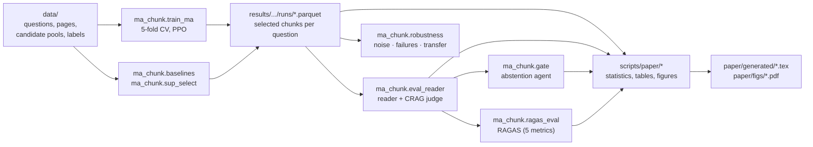

# Reproducing the paper

All numbers in the paper come from the commands below. Training needs no API key and no GPU; building candidate pools needs a GPU; labelling, end-task evaluation and RAGAS call an LLM (`gpt-5-nano`) through a local cache.

## 1. Setup

```bash
python -m venv .venv && source .venv/bin/activate      # Python 3.9 was used
pip install -r requirements.txt
python -m spacy download en_core_web_md
pip install -e .
python scripts/data/split_join.py join                   # rebuild the two large data files
cp .env.example .env                                     # add OPENAI_API_KEY only if you run LLM steps
python -m pytest                                         # property tests (~2 min, no API key needed)
```

## 2. Pipeline



## 3. Commands

**Main runs and ablations** (one process per λ × seed; ≈16 min and ≈4 Wh each on one CPU core):

```bash
for DS in crag hotpotqa musique; do
  scripts/run/train_grid.sh $DS ma_msg "0.1 0.3 0.6 1.0 2.0" "0 1 2" --save-models      # main method (frontier)
  scripts/run/train_grid.sh $DS ma_msg "0.3 1.0" "3 4" --save-models                     # extra seeds, main tests
  scripts/run/train_grid.sh $DS single "0.1 0.3 0.6 1.0 2.0" "0 1 2"                     # centralized agent
  scripts/run/train_grid.sh $DS single "0.3 1.0" "3 4"
  scripts/run/train_grid.sh $DS ma     "0.3 1.0" "0 1 2"                                 # no messages
  scripts/run/train_grid.sh $DS ma_msg "0.3 1.0" "0 1 2" --reward-mode terminal
  scripts/run/train_grid.sh $DS ma_msg "0.3 1.0" "0 1 2" --reward-mode individual
  scripts/run/train_grid.sh $DS ma_msg "0.3 1.0" "0 1 2" --turn-order random
  scripts/run/train_grid.sh $DS ma_msg "0.3 1.0" "0 1 2" --turn-order confidence
  scripts/run/train_grid.sh $DS ma_msg "0.3 1.0" "0 1 2" --with-random-agent
  scripts/run/train_grid.sh $DS ma_msg "0.3 1.0" "0 1 2" --top-m 4
  scripts/run/train_grid.sh $DS ma_msg "0.3 1.0" "0 1 2" --top-m 12
  scripts/run/train_grid.sh $DS ma_msg "0.3 1.0" "0 1 2" --rich-obs
  scripts/run/train_grid.sh $DS single "0.3 1.0" "0 1 2" --rich-obs
  scripts/run/train_grid.sh $DS ma_msg "0.3 1.0" "0 1 2" --agent-dropout 0.2 --save-models
  for A in a2c dqn recurrent_ppo; do scripts/run/train_grid.sh $DS ma_msg "0.3 1.0" "0 1 2" --algo $A; done
done
```

**Baselines and supervised selectors:**

```bash
python -m ma_chunk.baselines --out results/crag/baselines.parquet
python -m ma_chunk.baselines --pool data/hotpotqa/candidates.parquet --out results/hotpotqa/baselines.parquet
for M in logreg gbm; do for F in full obs; do
  python -m ma_chunk.sup_select --pool data/hotpotqa/candidates.parquet --model $M --features $F \
         --out-dir results/validation/hotpotqa/runs
done; done
```

**Robustness** (needs runs trained with `--save-models`):

```bash
python -m ma_chunk.robustness --dataset hotpotqa --out results/validation/robustness_hotpotqa.csv
python -m ma_chunk.robustness --dataset hotpotqa --suffix _drop0.2 --tests failure \
       --out results/validation/robustness_drop_hotpotqa.csv
```

**End task, abstention and RAGAS** (LLM calls, cached):

```bash
python -m ma_chunk.eval_reader --selections results/validation/hotpotqa/runs/ma_msg_lam1.0_s0.parquet \
       --pool data/hotpotqa/candidates.parquet --out-dir results/validation/hotpotqa/eval --name endtask
python -m ma_chunk.gate --eval results/validation/hotpotqa/eval/endtask_per_query.parquet \
       --pool data/hotpotqa/candidates.parquet --out results/validation/hotpotqa/eval/gate.csv
python -m ma_chunk.ragas_eval --per-query results/validation/hotpotqa/eval/endtask_per_query.parquet \
       --selections results/validation/hotpotqa/runs/ma_msg_lam1.0_s0.parquet \
       --sample data/hotpotqa/ragas_sample_ids.txt --out-dir results/ragas/hotpotqa
```

**MA-Chunk-P and RAGAS-aligned labels:**

```bash
scripts/run/train_grid.sh crag ma_msg "0.4 1.25" "0 1 2" --reward-mode marginal_ap --turn-order confidence
scripts/run/train_grid.sh hotpotqa ma_msg "0.3 1.0" "0 1 2" --reward-mode marginal_ap --turn-order confidence \
       --utility mix --attr-labels data/hotpotqa/attr_labels.parquet
```

**Costs (CodeCarbon):** `python scripts/paper/sustainability.py {train,sup,scoring} ...` (see the script's docstring).

## 4. Regenerating the tables and figures

The scripts in [`scripts/paper/`](../scripts/paper) read the raw outputs from `$MA_CHUNK_RESULTS` (default `results/`) with the layout of the results archive released with the paper, and write `paper/generated/*.tex` and `paper/figs/*.pdf`:

| Paper element | Script |
|---|---|
| Hypothesis tests, frontier AUC, multi-agent metrics (all CSVs) | `validation_analysis.py` |
| Table 2 (cluster-level tests) | `conservative_stats.py`, then `tables_validation.py` |
| Table 8 (costs), Appendix C table (algorithms) | `tables_validation.py` |
| Figures 1, 2, 4 | `figures.py` |
| Table 6 and Appendix B (end task), abstention | `tables_endtask.py` |
| Tables 7 and 8 (RAGAS), Figure 3 | `ragas_compare.py`, `tables_ragas.py` |
| RAGAS decisions (protocol Part B) | `ragas_decision.py`, `ragas_labels_select_lambda.py`, `ragas_labels_decision.py`, `reorder_selection.py`, `train_compare.py` |
| Judge and label reliability (κ) | `reliability.py` |

Results archive layout (`$MA_CHUNK_RESULTS`):

```
ma_chunk/            initial λ sweep (CRAG; hotpotqa_n1000/, musique_n1000/): runs, eval, baselines,
                     external-baseline contexts (paper_baselines*.parquet)
validation/          pre-specified validation: <dataset>/runs, <dataset>/eval, robustness_*.csv, analysis/
sustainability/      CodeCarbon measurements (costs.jsonl)
prior_selector/      end-task outputs of the prior single-agent RL selector
v4/                  RAGAS study: ragas/<dataset>/*.parquet, train/, eval/, a3/ (label study), labels/, r1/
```

## 5. Compute and cost

| Step | Hardware | Time | API |
|---|---|---|---|
| One training run (5 folds × 200k steps) | 1 CPU core | ≈16 min (R-PPO ≈47 min) | none |
| All RL runs of the paper (411) | 30 CPU cores | ≈4–5 h | none |
| Candidate pools | GPU | ≈45 min (CRAG), ≈10 min per multi-hop set | none |
| Labels, end task, RAGAS | — | minutes per condition | `gpt-5-nano`; a few US dollars overall; cached |

Notes: CPU energy is estimated by CodeCarbon from the processor's TDP when RAPL counters are not readable; GPU energy on a shared device is an upper bound.
